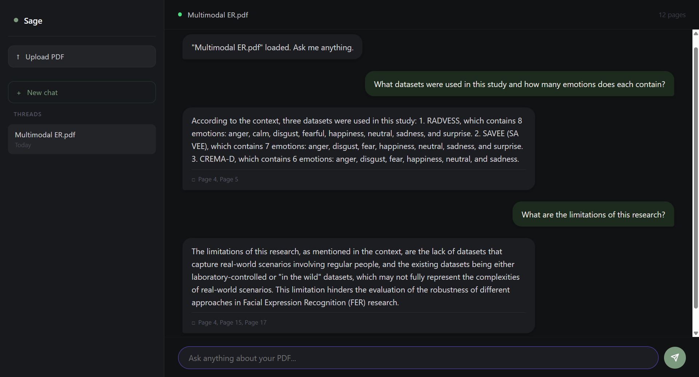

# Sage 
Chat with any PDF — semantic search, page citations, and agentic intent routing.



## Features
- Upload any PDF and have a conversation with it
- LangGraph routes intent — casual chat vs document questions
- FAISS vector search retrieves the most relevant chunks
- Answers include page citations so you know exactly where they came from
- Per-document thread history with the ability to switch between conversations

## Tech Stack
React · Flask · LangChain · LangGraph · FAISS · HuggingFace · Groq (Llama 3.3 70B)

## Getting Started

**Backend**
```bash
cd backend
pip install -r requirements.txt
python app.py
```
Add a `.env` file with `GROQ_API_KEY=your_key`

**Frontend**
```bash
cd frontend/pdf-chat
npm install
npm start
```

## Roadmap
- [ ] Citation display in UI
- [ ] Document summary on upload
- [ ] Multi-document support
