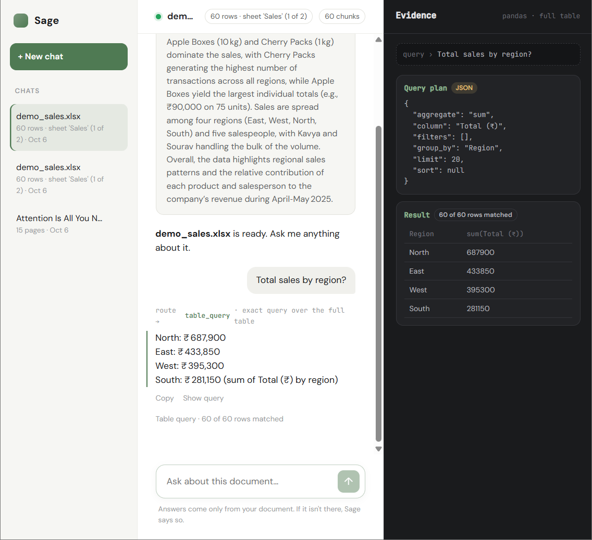
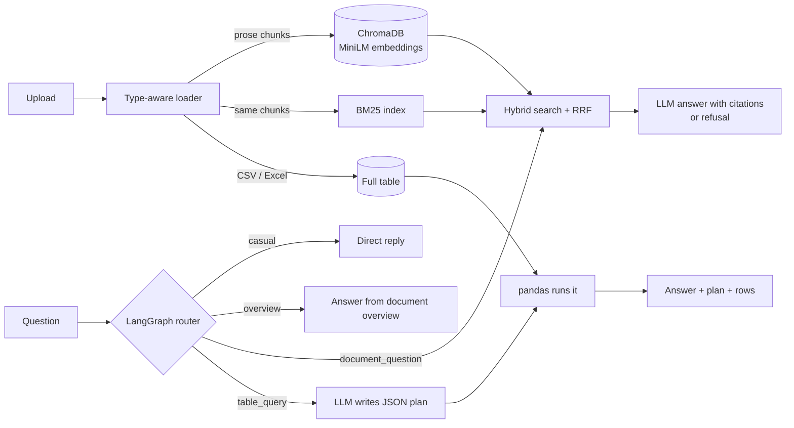

# Sage

**Chat with your documents (PDF, TXT, CSV, Excel). Every answer cites the exact chunk it came from, and Sage says so when the answer isn't in the document.**

**Live demo:** https://sage-ebon.vercel.app
*(Free hosting: the first request after 15 idle minutes takes about 50 seconds while the server wakes up.)*



<!-- Add a second screenshot here, e.g. a PDF answer with citations:
 -->

## What it does

- **Chunk-level citations:** answers carry numbered citations like `[1]`. Clicking one opens the exact chunk in the Evidence panel, with its location (`Page 7`, `Lines 120–134`, `Rows 2–9`), how it was found (keyword, meaning or both) and its scores.
- **Refuses instead of guessing:** if the document doesn't contain the answer, Sage replies *"I couldn't find this in the document."*
- **Hybrid search:** BM25 keyword search plus dense vector search (ChromaDB), merged with Reciprocal Rank Fusion. Keyword search catches exact terms like `d_model`; vector search catches paraphrases.
- **Type-aware chunking:** prose (PDF/TXT/MD) is split into 128-token chunks measured with the embedding model's own tokenizer. Tables (CSV/Excel) are split by whole rows, and every chunk repeats the column names.
- **Exact table answers:** for counting, totals, averages, filters and grouping, the LLM writes a JSON query plan and **pandas runs it over the full table**. The model never does the maths. The plan and result are shown as evidence.
- **Agentic routing (LangGraph):** each message is routed to `casual`, `overview`, `document_question` or `table_query`, with rule-based safety nets when the classifier is unsure.
- **Excel support:** reads the first non-empty sheet, skips title rows above the header, and tidies dates and numbers.
- **Resilient LLM calls:** retries with backoff, then falls back to a smaller model if Groq is overloaded.

## Evaluation

A 38-question golden set over three documents: *Attention Is All You Need* (PDF), *Alice in Wonderland* (TXT) and the Titanic dataset (CSV). It includes questions that **should** be refused. Run it with `python eval/run_eval.py`.

| Metric | Result |
|---|---|
| Answer accuracy | 100% (28 questions) |
| False refusal rate | 0% |
| Refusal accuracy (unanswerable questions) | 100% (8 questions) |
| Route accuracy | 100% |
| Retrieval hit@5 (PDF) | 100% |
| Citation precision (PDF) | 100% |
| Median latency | 3.4 s |

*Single run on the current version. LLM answers vary slightly between runs.*

**Ablation (PDF questions, earlier version):** hybrid search scored 100% answer accuracy vs 92% for dense-only and 92% for keyword-only. Run it with `python eval/run_eval.py --ablation`.

## How it works


```mermaid
flowchart LR
    U[Upload] --> L[Type-aware loader]
    L -->|prose chunks| C[(ChromaDB<br/>MiniLM embeddings)]
    L -->|same chunks| B[BM25 index]
    L -->|CSV / Excel| T[(Full table)]

    Q[Question] --> R{LangGraph router}
    R -->|casual| A1[Direct reply]
    R -->|overview| A2[Answer from document overview]
    R -->|document_question| H[Hybrid search + RRF] --> A3[LLM answer with citations<br/>or refusal]
    R -->|table_query| P[LLM writes JSON plan] --> X[pandas runs it] --> A4[Answer + plan + rows]
    C --> H
    B --> H
    T --> X
```

## Tech stack

**Backend:** Python, Flask, LangGraph, LangChain, ChromaDB, rank-bm25, pandas, ONNX Runtime (all-MiniLM-L6-v2, no PyTorch), Groq (GPT-OSS 120B / 20B), Gunicorn, Docker
**Frontend:** React, react-markdown (tables and LaTeX maths)
**Hosting:** Render (backend, Docker) and Vercel (frontend)

The embedding model runs on ONNX Runtime instead of PyTorch, with small batches and dynamic padding, so the whole backend fits in the 512 MB free tier.

## Run it locally

**Backend**
```bash
cd backend
pip install -r requirements.txt
python app.py
```
Create `backend/.env` containing `GROQ_API_KEY=your_key` (free key from console.groq.com). The first start downloads the embedding model (about 90 MB).

**Frontend**
```bash
cd frontend
npm install
npm start
```

**Evaluation** (with the backend running): put the three test files listed in `eval/questions.json` into `eval/docs/`, then run `python eval/run_eval.py`.

### Settings

| Variable | Where | Purpose |
|---|---|---|
| `GROQ_API_KEY` | backend | Groq API key (required) |
| `ALLOWED_ORIGINS` | backend | Websites allowed to call the API, comma-separated (default `*`) |
| `GROQ_MODEL` / `GROQ_FAST_MODEL` | backend | Override the main and fast models |
| `DEBUG_RETRIEVAL` | backend | Set to `1` to log routes and search scores |
| `REACT_APP_API_URL` | frontend | Backend URL (default `http://127.0.0.1:5000`) |

## Limitations

- Scanned (image-only) PDFs aren't supported, since there is no OCR.
- Excel: `.xlsx` only, one sheet per upload.
- Files up to 10 MB. Uploads are cleared when the free server restarts.
- Uploaded content is sent to Groq to generate answers, so don't upload confidential data to the public demo.
